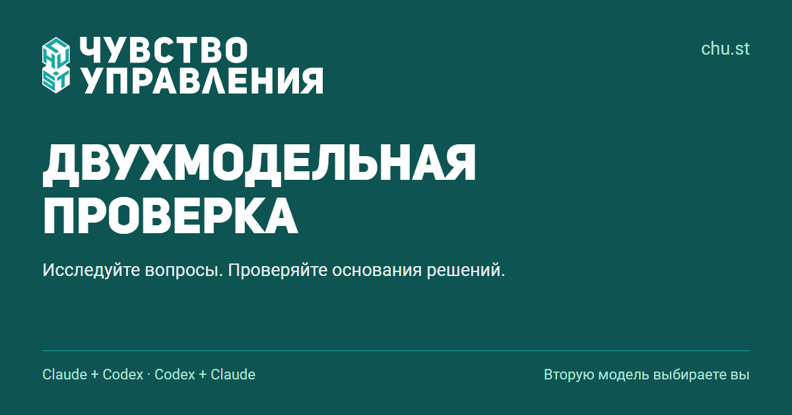

# CHU.ST Skills

An open, evidence-oriented review with **two or three models** for research,
decisions, plans, documents, and code. Built at [chu.st — Чувство управления](https://chu.st/).

**Choose models in your prompt or save your preferred roles.** The same
`dual-model-review` skill supports an orchestrator, a regular second model, and an
optional third. Default to two unless the saved profile or task requests three.
Setup is a mode of this skill, not a separate skill. User preferences live outside
the installation and survive updates. No provider is mandatory.

Automatic execution needs access to each selected product/model; otherwise exchange
a neutral brief and actual answers between chats. The third receives the original
brief independently, not the second's conclusions. Resolve disagreements with
evidence, never by a two-to-one vote. If a requested participant is unavailable,
retain useful partial work and label the requested run incomplete.

- Claude Code → Codex, with an explicit model ID.
- Codex → Claude, with an explicit model ID or alias such as `opus`.
- Other agents through available connectors or an explicit CLI argument adapter.
- Any text chat through the [standalone prompt](prompts/start-en.md).
- Gemini through an available tool for the selected product, a configured generic
  CLI adapter, or manual chat handoff. No native Gemini adapter is bundled.

Example: “Configure dual-model-review: Claude Fable orchestrates, ChatGPT is second,
Gemini is third; default to two.” Then: “Review this plan with three models.” This
is an example profile, not a package default. ChatGPT, Codex, and API access are
distinct; the skill does not silently switch products or orchestrators.

The [skill](skills/dual-model-review/SKILL.md) and references are in English so
agents can reuse them; answer users in their own language. The README, onboarding,
and research example are primarily in Russian.

[Install](docs/install.md) · [Configuration](skills/dual-model-review/references/configuration.md)
· [What's new](WHATS_NEW.md) · [Transport details](skills/dual-model-review/references/transports.md)
· [Research example](examples/research/README.md) · [Validation](docs/validation.md)

[Pilot: same-model and different-model review](evaluations/2026-09-pilot/results.md)

Two models agreeing is not evidence of correctness. Validate material findings
against primary evidence or reproducible checks. Record limitations and distinguish
successful delivery from a quality verdict. No universal accuracy or cost claim.

Python 3.10+ is only needed for optional CLI and installation helpers. Provider
authentication and usage charges remain yours. No telemetry or data sent to chu.st.

Maintained by Timur Semenov / CHU.ST. Contact: timsem@chu.st. [MIT license](LICENSE).
